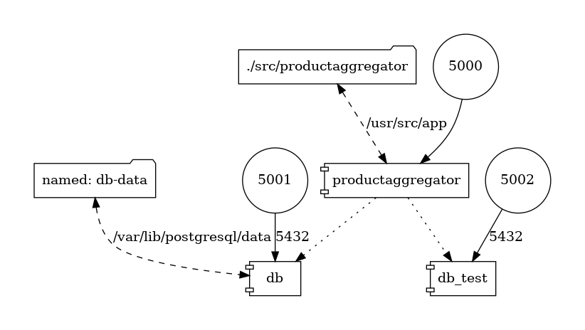
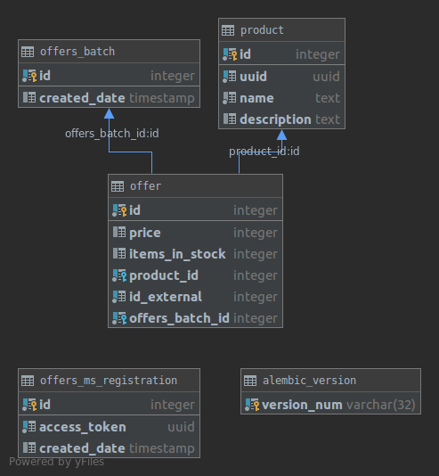

# API specification
```
PRODUCT = {"id": <int>, "name": <str>, "description": <str or null>}
```

### GET /products/
Retrieve array of all products.
#### Responses:
**200**
```
[<PRODUCT>]
```

### POST /products/
Create a new product.
#### Request:
```
<PRODUCT>
```
#### Responses:
**201**
```
<PRODUCT>
```
**400**
```
{'message': 'No input data provided'}
```
**422**
```
{'message': [<validation error messages>]}
```
**503**
```
{'message': 'Call to external service failed.'}
```

### GET /products/{id}/
Retrieve a single product.
#### Responses:
**200**
```
<PRODUCT>
```
**404**
```
{'message': 'Not found.'}
```
### PATCH /products/{id}/
Update an existing product's fields.
#### Request:
```
{"name": <str>, "description": <str or null>}
```
#### Responses:
**200**
```
<PRODUCT>
```
**400**
```
{'message': 'No input data provided'}
```
**404**
```
{'message': 'Not found.'}
```
**422**
```
{'message': [<validation error messages>]}
```

### DELETE /products/{id}/
Delete an existing product.
#### Responses:
**204**

**404**
```
{'message': 'Not found.'}
```
# Deployment on Heroku
1. Enable "Heroku Postgres" add-on and attach to the app.
2. Run `cd src/productaggregator && ./deploy.sh` to push and release image using Heroku Container Registry.
3. Enable Heroku scheduler add-on and create job scheduled to every 10 minutes with 
command `python manage.py retrieve_new_offers`.

# Development environment
`docker-compose.yml` is provided for development and testing purposes. 
There are 2 Postgres services - a persistent one for development and one without a volume for running tests.

Generated using one-liner from https://github.com/pmsipilot/docker-compose-viz

## Testing
```
./run_tests.sh
```
Most tests run within the flask app context.
A fresh empty database is provided to each test function call. 
`requests-mock` is used to avoid Offers MS dependency.

# Offers MS interaction
Calls to the Offers MS are handled by `offers_ms_client.OffersMsClient`. The base url can be configured using the
`OFFERS_MS_BASE_URL` env var.

## Access token
The Offers MS access_token is tied to the lifecycle of the database. This is done using a "single row" table 
`OffersMsRegistration`.
The problem specification suggests that the registered products are "tied" to the access_key. Even though that does not 
seem to be the case, I decided to keep this solution to conform to the specification.

## Product registration
Because the `GET /products/:id:/offers` endpoint does not take access_token into account, the product ids are shared
among all users of the service. This is resolved by using a UUID, however the classic serial int is still used for
the database primary key and in the CRUD API.

The call to `POST /products/register` is done within the POST request for product creation and 503 is returned in case 
it fails.

## Updating offers
I used Heroku scheduler, which runs the background job in a "One-off dyno".
The minimal time interval it supports is 10 minutes, which is less frequent than the 1 minute interval suggested by the 
specification. However, it is a simple solution for this challenge.

# Relational model


# Chosen packages
I decided to use this opportunity to learn Flask because of its popularity in microservices. 
I am accustomed to Django's ORM system and Django Rest Framework. 
When setting up the Flask project and choosing the right combination of Flask extensions, I saw the price that is paid 
for the improved performance and configurability compared to Django's standard project structure and app system.

I used `FlaskRESTful` because `Flask-RESTless` seemed less popular and not well maintained.

I decided to use `Flask-SQLAlchemy` and `Flask-Migrate` for ORM. `marshmallow` is used for serialization and validation 
rather than FlaskRESTful's system. `Flask-Marshmallow` and `marshmallow-sqlalchemy` were not needed because 
`SQLAlchemyAutoSchema` and `ma.auto_field()` were not necessary in this project. 
`Flask-Script` is used tu run the offer update.
 